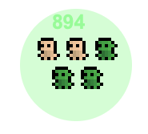

<div style="text-align: justify">

# <center>Projet d'Architecture Logiciel : Wanderer</center>

<br/>
par Antoine LE FLOHIC et Sebastian PAGES
<br/>

#  Sommaire

### [1. Introduction](#-1---Introduction)

### [2. Architecture du projet](#-2---Architecture-du-projet)

### [3 - Guide d'Utilisation](#-3---Guide-Utilisation)


# 1 - Introduction

Ce jeu appelé Wanderer est un mini jeu où le but est de survivre dans une arène avec son armée dans le but d'y battre le boss de fin. Pour cela il est possible de recruter jusqu'à 9 soldats dans notre armée et de les équiper d'armes et de boucliers que l'on trouve par terre. 
Notre armée possède donc un total de points de vie ( visible pour le joueur ), une attaque et une défence ( invisible pour le joueur ). 
Lors d'un recrutement de nouvelles unitées ou de l'ajout d'équipements il faut avoir un score assez élevé pour pouvoir le dépenser ( le prix des nouveaux soldats est de 1 soldat = 1 de score).
Pour gagner en score il faut donc battre des armées enemies dans le but de dépenser ce score ou d'Invoquer le boss final lorsque notre score est supérieur à 10.


# 2 - Architecture du projet

Voici la structure du projet. 
```
src/
│
├── Main/                   # Contient le Main file du projet
│
├── soldier/                # Racine du code du projet
│   ├── ages/               # Factory des ages ( Middle et Future )
│   ├── core/               # Ensemble des classes principales du projet
│   ├── equipement/         # Equipements et leurs Behaviors
│   ├── factories/          # Factory des objets visibles ( Player et Loot )
│   ├── gameManagement/     # Classes Necessaires pour le bon déroulement du jeu
│   ├── ui/                 # Builder et les UI
│   ├── units/              # Unites et leurs Behaviors
│   ├── util/               # Observateur
│   ├── visitor/            # Visiteur
│   └── visualObjects/      # Racine du parseur
│
└── README.md
```

# 3 - Guide Utilisation

## Lancement
Il y a deux façon de lancer une partie de Wanderer.

- Executer le Main 

ou

- Lancer l'executable avec la commande suivante:
`java --module-path /Users/PATH_TO_FX/Desktop/javafx-sdk-11.0.2/lib --add-modules javafx.controls,javafx.fxml -jar Wanderer.jar`

## Règles du jeu

Element à connaitre:

| Element       | Image                                  |  Description                     |
| ------------- |: ------------------------------------: | : -----------------------------: | 
| Armée Alliée  |     | À Recruter contre du score       |
| Armée Ennemie |   | À Combattre pour du score        |
| Equipment     || Equipe ton armée conte du score  | 
| Potion        |   | Soigne ton armée                 | 
| Boss          |     | À Combattre pour gagner          | 

Déplacez votre armée avec la souris. Augmenter votre score en gagnant des combats et en vous aidant de vos alliés.
Une fois un score de 10 atteint,tué le boss pour gagner. Évitez les combats qui ne sont pas à votre avantage.
Appuyer sur `p` pour metre en pause et `échap` pour quitter.

On peut ajuster les Parametres d'une partie dans le fichier [Settings](src/soldier/gameManagement/Settings.java)

</div>

## Credit
Les images sont faites par Krishna Palacio
Inspiré par le jeu Wanderer.io